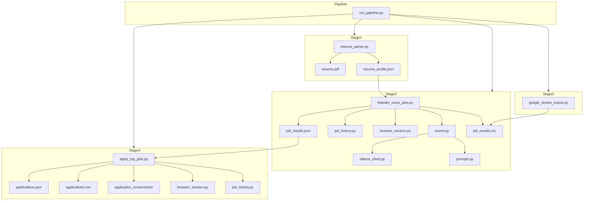

# job-agent

Automated LinkedIn job discovery, LLM-powered scoring, and browser-based application tool for data engineering roles.

Job-agent searches LinkedIn for matching roles, evaluates each job against your resume and preferences using a local LLM (Ollama), and can partially automate the application process — all while keeping you in control before final submission.

---

## Features

- **Resume parsing** — extracts skills, domains, years of experience, and leadership signals from a PDF resume
- **Multi-keyword LinkedIn search** — searches across multiple job titles and deduplicates results
- **LLM-powered scoring** — evaluates jobs across six weighted dimensions using a local LLM (Qwen via Ollama):
  - Technical fit (35%)
  - Seniority match (25%)
  - Leadership & architecture (15%)
  - Location fit (10%)
  - Domain fit (10%)
  - Growth opportunity (5%)
- **Google Sheets export** — pushes scored results to a Google Sheet for review
- **Browser-based application automation** — navigates LinkedIn Easy Apply and external ATS forms, fills candidate fields, uploads your resume, and stops before final submit
- **Job history tracking** — remembers which jobs have been seen, scored, or applied to across runs
- **Persistent browser session** — LinkedIn login persists between runs via a local Chromium profile

---

## Architecture



### Modules

| File | Role |
|---|---|
| `run_pipeline.py` | Orchestrator — runs the four pipeline stages sequentially |
| `resume_parser.py` | Extracts text from `resume.pdf`; builds a structured skill/domain profile |
| `linkedin_score_jobs.py` | Searches LinkedIn, scrapes job details, scores each via LLM |
| `scorer.py` | Builds scoring prompts, validates LLM responses, computes weighted scores |
| `ollama_client.py` | HTTP client for the local Ollama API with retry and JSON parsing |
| `prompts.py` | LLM prompt template for job scoring |
| `browser_session.py` | Launches a persistent Chromium context via Playwright |
| `apply_top_jobs.py` | Automates job applications through Easy Apply and external ATS forms |
| `job_history.py` | Tracks previously seen/applied jobs across runs |
| `google_sheets_export.py` | Uploads job results to Google Sheets |
| `config.py` | All tunable settings: paths, weights, thresholds, skill lists |

---

## Prerequisites

- **Python 3.11+**
- **Chrome** (or Chromium) installed on your system
- **Ollama** running locally with a model pulled (tested with `qwen3:8b`)

---

## Installation

```bash
# 1. Clone the repository
git clone https://github.com/ankit-shandilya/job-agent.git
cd job-agent

# 2. Create a virtual environment
python -m venv venv

# 3. Activate it
# Windows:
venv\Scripts\activate
# macOS / Linux:
source venv/bin/activate

# 4. Install dependencies
pip install -e .

# 5. Install Playwright browsers
playwright install chromium
```

---

## Configuration

### 1. Place your resume

Put `resume.pdf` in the project root.

### 2. Configure Ollama

```bash
# Pull the recommended model
ollama pull qwen3:8b
```

Override model or URL in `config.py` if needed:

```python
OLLAMA_MODEL = "qwen3:8b"              # or any Ollama model
OLLAMA_URL = "http://localhost:11434/api/generate"
```

### 3. Set up your candidate profile

Edit `candidate_profile.json`:

```json
{
  "years_of_experience": 11,
  "current_role": "Senior Data Engineer",
  "target_roles": ["Lead Data Engineer", "Principal Data Engineer"],
  "must_have_skills": ["Python", "SQL", "PySpark", "Databricks"],
  "preferred_skills": ["Azure", "GCP", "Airflow", "Kafka"],
  "preferred_locations": ["Bengaluru", "Remote"]
}
```

### 4. Set up your application profile

Edit `application_profile.json`:

```json
{
  "resume_path": "C:\\job-agent\\resume.pdf",
  "candidate": {
    "first_name": "Your",
    "last_name": "Name",
    "email": "you@example.com",
    "phone": "+91 9999999999",
    "city": "Bengaluru",
    "country": "India",
    "current_title": "Senior Data Engineer",
    "years_of_experience": "11"
  },
  "safe_autofill": true,
  "stop_before_submit": true
}
```

### 5. (Optional) Google Sheets export

Create a Google Cloud service account, download its JSON key, and save it as `google_service_account.json` in the project root. Share your Google Sheet with the service account email.

Set the environment variable (optional):

```bash
set JOB_AGENT_SHEET_NAME=Job Tracker
```

### 6. LinkedIn search keywords

Edit `SEARCH_KEYWORDS` and `SEARCH_LOCATION` in `config.py`:

```python
SEARCH_KEYWORDS = [
    "Principal Data Engineer",
    "Lead Data Engineer",
    "Staff Data Engineer",
    "Senior Data Engineer",
]
SEARCH_LOCATION = "India"
JOB_LIMIT = 25
```

---

## Running the Pipeline

### First run: LinkedIn login

The first time you run any LinkedIn automation, you need to log in manually:

```bash
python linkedin_test.py
```

A Chrome window opens. Log in to LinkedIn (do **not** use "Continue with Google" — type your email and password directly). After logging in, press Enter in the terminal. Your session is saved to `browser-profile/` and reused for all subsequent runs.

### Full pipeline

```bash
python run_pipeline.py
```

This runs four stages:

1. **Resume parsing** — extracts your skills and experience from `resume.pdf`
2. **LinkedIn discovery & scoring** — searches for jobs, scrapes details, scores each against your profile using Ollama
3. **Google Sheets export** — uploads results (skips gracefully if not configured)
4. **Apply to top jobs** — prompts for confirmation, then opens top-N jobs and fills application forms

The script stops before any final submit button — you review and click manually.

### Individual stages

```bash
# Parse resume only
python resume_parser.py

# Search and score only
python linkedin_score_jobs.py

# Export to Google Sheets only
python google_sheets_export.py

# Apply to top jobs only (requires job_results.json)
python apply_top_jobs.py
```

---

## Scoring

Jobs are scored on a 0–100 scale. Scores determine a status bucket:

| Score range | Status |
|---|---|
| 90–100 | Apply |
| 80–89 | Review |
| 65–79 | Maybe |
| 0–64 | Reject |

The LLM evaluates each job across six weighted dimensions:

| Dimension | Weight | What it measures |
|---|---|---|
| Technical fit | 35% | Must-have and preferred skills from job description |
| Seniority | 25% | Role level match (Principal, Lead, Staff, Senior) |
| Leadership | 15% | Architecture ownership, mentoring, cross-functional work |
| Location | 10% | Bengaluru preferred, India acceptable, remote preferred |
| Domain | 10% | Supply chain, banking, pharma, financial services, healthcare |
| Growth | 5% | Modern tech exposure, strategic influence, career progression |

---

## Folder Structure

```
job-agent/
├── run_pipeline.py              # Pipeline orchestrator
├── config.py                    # All settings and constants
├── resume_parser.py             # PDF resume → structured profile
├── linkedin_score_jobs.py       # LinkedIn search + detail + scoring
├── scorer.py                    # LLM scoring logic
├── ollama_client.py             # Ollama HTTP client
├── prompts.py                   # LLM prompt templates
├── browser_session.py           # Playwright browser launcher
├── apply_top_jobs.py            # Application automation
├── job_history.py               # Job deduplication across runs
├── google_sheets_export.py      # Google Sheets upload
├── pyproject.toml               # Project metadata and dependencies
│
├── candidate_profile.json       # Your skills, locations, preferences
├── application_profile.json     # Your personal details for forms
├── resume.pdf                   # Your resume (you provide)
│
├── resume_profile.json          # Generated resume analysis
├── job_results.json             # Scored job results (JSON)
├── job_results.csv              # Scored job results (CSV)
├── applications.json            # Application records (JSON)
├── applications.csv             # Application records (CSV)
├── job_history.json             # Tracking across runs
│
├── application_screenshots/     # Screenshots from apply attempts
├── browser-profile/             # Persistent Chromium session
├── logs/                        # Runtime logs
├── interview_notes/             # (Future use)
│
├── linkedin_test.py             # Login helper
├── test_scorer.py               # Quick scorer test
├── linkedin_extract_test.py     # Extraction debug script
├── qwen_score_test.py           # Ollama connectivity test
│
├── venv/                        # Virtual environment
└── .gitignore                   # Git ignore rules
```

---

## Troubleshooting

### "No module named ..."

```bash
pip install -e .
playwright install chromium
```

### Ollama connection refused

Ensure Ollama is running:

```bash
ollama serve
```

Test connectivity:

```bash
python qwen_score_test.py
```

### LinkedIn login required

The browser session expires occasionally. Re-run the login helper:

```bash
python linkedin_test.py
```

Log in manually in the Chrome window, then press Enter.

### Job descriptions are empty

LinkedIn's DOM changes frequently. If descriptions are consistently empty, the CSS selectors in `linkedin_score_jobs.py` may need updating. Check that the detail page loads correctly by running the extraction test:

```bash
python linkedin_extract_test.py
```

### Application forms are not filling

The autofill in `apply_top_jobs.py` uses heuristic label matching (`label_text_for_input`, `value_for_label`). If a field is not being filled, the form likely uses a non-standard label or input type. Check `application_screenshots/` for visual confirmation.

### Scores are all 0

Ensure Ollama is running and a model is pulled. Check that the resume was parsed successfully:

```bash
python resume_parser.py
cat resume_profile.json
```

---

## Future Roadmap

- **SQLite backend** — replace JSON files with a queryable database
- **Cover letter generation** — LLM-generated cover letters tailored to each job
- **Multiple LLM providers** — support for Gemini, OpenRouter as fallback or alternatives
- **Application status tracking** — end-to-end pipeline from discovery to offer
- **Web dashboard** — simple UI for reviewing scores and triggering applies
- **CI/CD** — automated tests via GitHub Actions
- **Docker support** — containerized pipeline with bundled Ollama

---

## License

MIT
